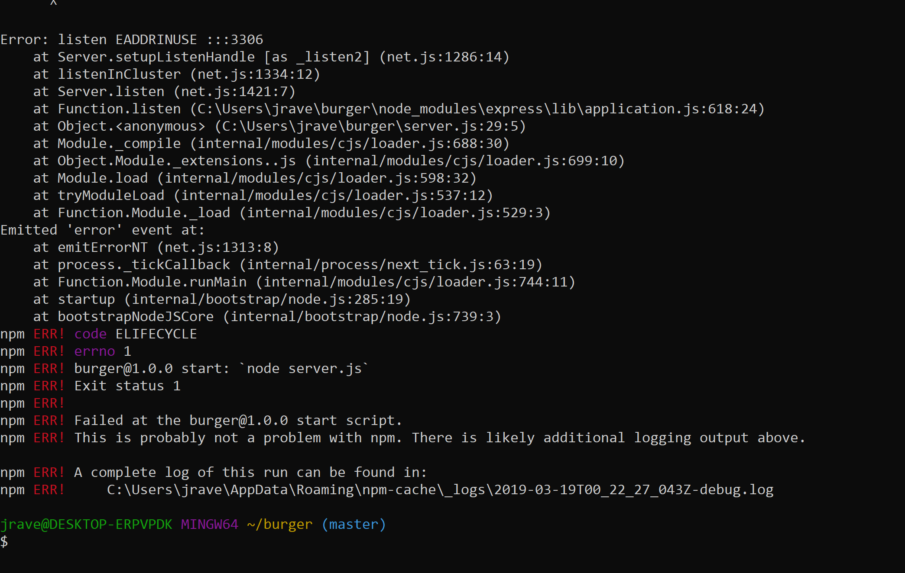

Eat Da Burger!
A Burger Eatin' Application With Node.js/Express/MySQL/Handlebars/Materialize

Description
This is a simple full stack application.

I kept getting an NPM error for every port i tried. 
Here is the link to Heroku that doesn't work.
https://burger7600.herokuapp.com/

